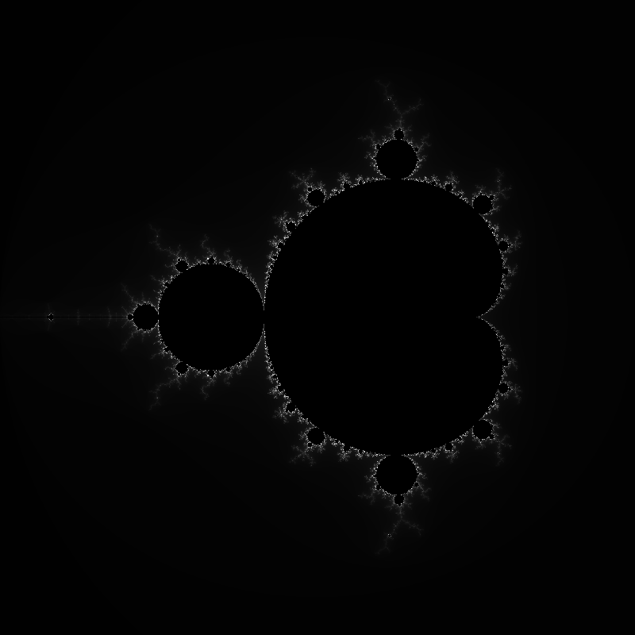
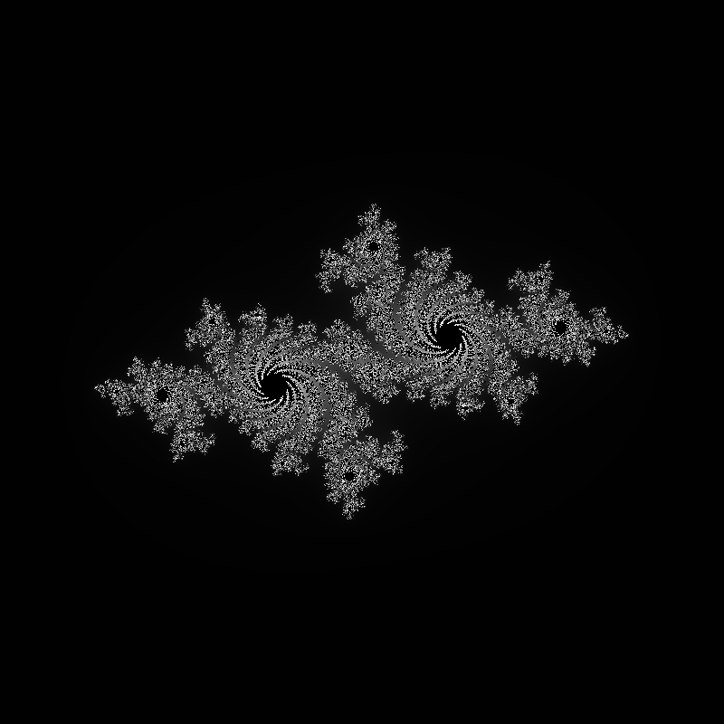
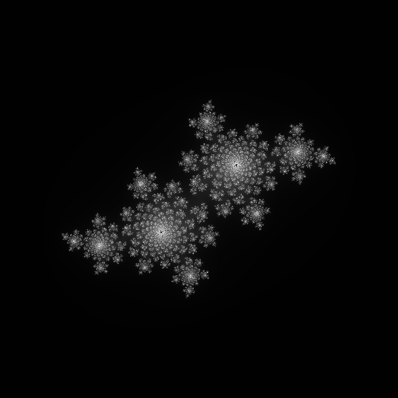
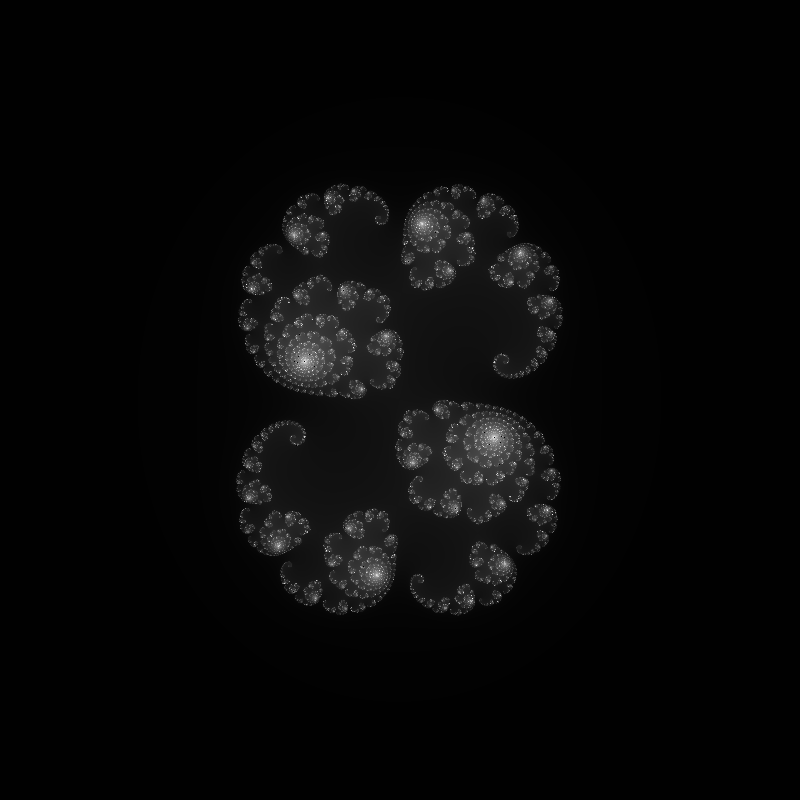
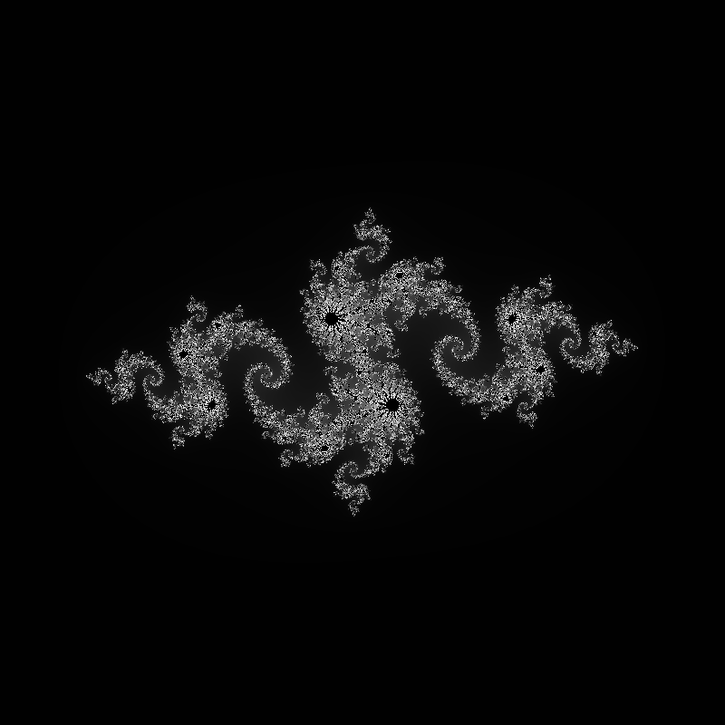
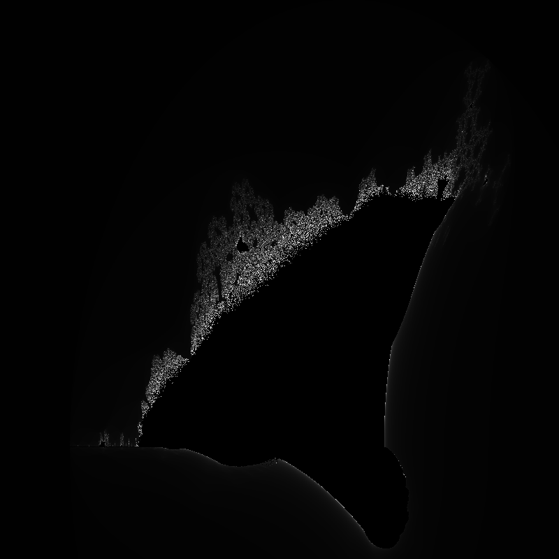
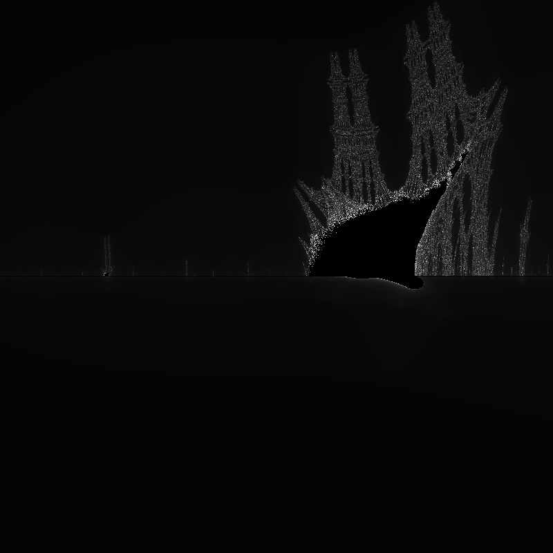

# Fractals

Fractal renderer written in Julia — Mandelbrot sets, Julia sets, and the Burning Ship fractal, rendered to PNG.

---

## Gallery

| Fractal | Preview |
|---|---|
| Mandelbrot Set |  |
| Julia — Dendrite |  |
| Julia — Rabbit |  |
| Julia — Snowflake |  |
| Julia — Spiral |  |
| Burning Ship |  |
| Burning Ship Zoom |  |

---

## Features

- Three fractal types: Mandelbrot, Julia sets, Burning Ship
- Four Julia set presets covering the most iconic parameter values
- Logarithmic brightness mapping for better contrast and detail
- Correct y-axis orientation with sub-pixel accurate coordinate mapping
- All outputs at 800×800px, 256 max iterations
- Outputs verified after every run

---

## Project Structure

```
iteration-zero/
├── src/
│   ├── main.jl           # Entry point
│   ├── render.jl         # Coordinate mapping + rendering loops
│   ├── mandelbrot.jl     
│   ├── julia_set.jl      
│   ├── burning_ship.jl  
│   └── colours.jl        # Iteration count -> greyscale image
├── output/            
├── Project.toml
└── README.md
```

---

## Math behind teh Fractals

### Mandelbrot Set

For each pixel mapped to complex number `c`, iterate:

```
z₀ = 0
zₙ₊₁ = zₙ² + c
```

A point is in the set if `|z|` never exceeds 2 after `max_iter` iterations.
Points that escape are coloured by how quickly they escape.

### Julia Sets

A fixed complex constant `c` is chosen, and each pixel maps to the
starting value `z₀`. The same iteration runs:

```
zₙ₊₁ = zₙ² + c
```

Different values of `c` produce entirely different shapes.
The four presets used here are:

| Name | c |
|---|---|
| Dendrite | `-0.7 + 0.27015i` |
| Rabbit | `-0.4 + 0.6i` |
| Snowflake | `0.285 + 0.01i` |
| Spiral | `-0.8 + 0.156i` |

### Burning Ship

Like Mandelbrot, but absolute values are applied to both components
before squaring each iteration:

```
zₙ₊₁ = (|Re(zₙ)| + i|Im(zₙ)|)² + c
```

This breaks symmetry and produces the distinctive ship silhouette visible
in the zoomed render.

---

## Coordinate Mapping

Each pixel `(px, py)` maps to a complex number via:

```
re = x_min + ((px - 1) / (width  - 1)) × (x_max - x_min)
im = y_max - ((py - 1) / (height - 1)) × (y_max - y_min)
```

The `- 1` terms correct for Julia's 1-based indexing so the mapping
spans exactly `[x_min, x_max] × [y_min, y_max]`.
The imaginary axis is subtracted (not added) so that screen rows
increasing downward correctly correspond to `im` decreasing.

---

## Colouring

Brightness is mapped logarithmically from iteration count:

```
t = log(1 + n) / log(1 + max_iter)
```

Points inside the set render black. Log scaling distributes detail
across the full brightness range — linear mapping clusters most pixels
near black since the majority of escaping points escape quickly.

---

## License

MIT
